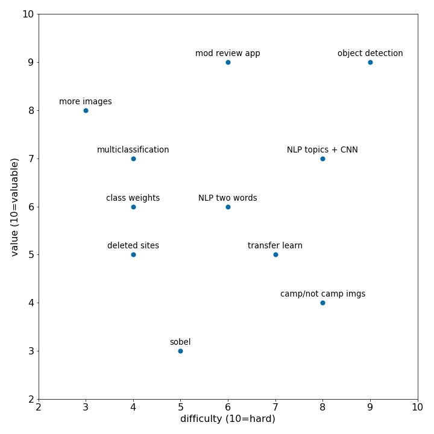

# Capstone 3 project ideas

1. continue development of campsite prediction with some of these ideas

* try transfer learning models
* Clean training data
* more data, more diversity
* pull random sat images as "not campsite"
* determine the actual campsite coordinates within the image (patch detect?)
* Try sobel transformation
* Include additional binary columns such as “bathrooms” etc
* Utilize NLP topics to aid image classification
* Multiclassification
* Train with additional sat images
* Implement class weights
* NLP with higher level tokens than words
* Examine F1 scores
* More dropouts in model

To prioritize the above, I assigned each a value rank and difficulty rank (10 is high value and high difficulty):

In more detail these potential tasks and an idea of my timeline are:

| task                                           | detail                         | notes                                      | to do          |   difficulty (10=hard) |   value (10=valuable) |
|:-----------------------------------------------|:-------------------------------|:-------------------------------------------|:---------------|-----------------------:|----------------------:|
| pull more images                               | more data more diversity       | setup colab to run it                      | yes Sunday     |                      3 |                     8 |
| pull info deleted / closed                     | examine viability of this data |                                            | yes Sunday     |                      4 |                     5 |
| sobel transformation                           | improve model?                 | write function                             | yes Monday     |                      5 |                     3 |
| transfer learning models                       | improve model?                 |                                            | eval if needed |                      7 |                     5 |
| object detection                               | new feature                    | chapter 14..  489 485… YOLO..  Look once.. | maybe          |                      9 |                     9 |
| multiclassification                            | include other cols like binary |                                            | yes Tuesday    |                      4 |                     7 |
| implement class weights                        | improve model?                 |                                            | eval if needed |                      4 |                     6 |
| NLP with higher level tokens than words        | improve model?                 |                                            | maybe          |                      6 |                     6 |
| specific camp and not camp images              | new feature                    |                                            | maybe          |                      8 |                     4 |
| Utilize NLP topics to aid image classification | new feature                    |                                            | yes Monday     |                      8 |                     7 |
| moderator review app                           | new feature                    |                                            | yes Wednesday  |                      6 |                     9 |

Based on this assessment, MVP for the week is:
* pipeline to clean sat images (sobel or not)
* assessment of multiclass feasibility
* moderator app
* NLP for classification of images and moderation

MVP +:
* transfer learning, possibly including object detection
* assessment of deleted / closed predictions

MVP ++:
* ability to distinquish camp / not camp
* GPS coordinates of best prediction of camp location
